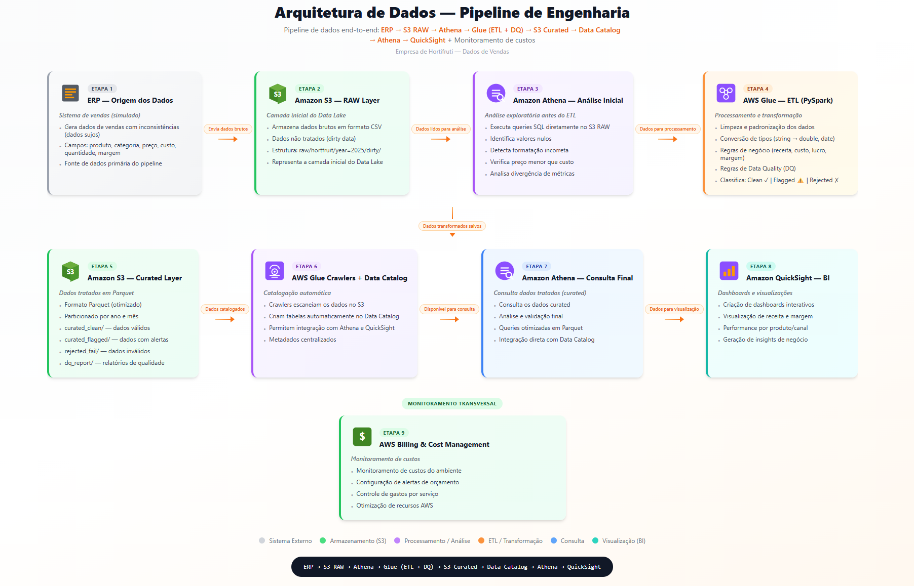

# 🚀 AWS End-to-End Data Engineering Pipeline


---

## ⚡ TL;DR

Pipeline de dados end-to-end na AWS que transforma dados brutos (CSV) em uma camada analítica confiável, utilizando S3, Athena, Glue (PySpark) e QuickSight, com foco em Data Quality, otimização de custos e arquitetura em camadas (RAW → Curated → Gold).

---

## 📌 Sobre o Projeto
Este projeto implementa um pipeline completo de engenharia de dados **end-to-end na AWS**, simulando um cenário real de uma empresa de hortifruti.

O objetivo é transformar dados brutos de vendas (com inconsistências) em uma camada analítica confiável, permitindo geração de insights estratégicos através de dashboards executivos.

---

## ▶️ Como reproduzir o projeto

1. Fazer upload do dataset no S3:
   - bucket: hortfruit-data-lake-2025
   - path: raw/hortfruit/year=2025/dirty/

2. Criar Glue Crawler para a camada RAW

3. Executar queries exploratórias no Athena

4. Rodar o Glue Job (etl/glue_job.py)

5. Criar novo crawler para camada Curated

6. Criar views na camada Gold:
   - analytics/gold_views.sql

7. Conectar o Athena ao QuickSight

---

## 💼 Problema de Negócio

Empresas de varejo frequentemente enfrentam:

- Dados inconsistentes
- Falta de padronização
- Dificuldade em gerar insights confiáveis
- Alto custo de análise

---

## 🎯 Solução

Este projeto resolve esses problemas através de:

- Pipeline end-to-end
- Data Quality estruturado
- Camada analítica (Gold Layer)
- BI executivo
- Governança de custos

---

## 🏗️ Arquitetura do Pipeline

[](https://pipeline-end-to-end.base44.app)

🔗 [Acesse o diagrama interativo](https://pipeline-end-to-end.base44.app)

---

## 🎥 Demonstração do Projeto

▶️ Assista ao vídeo completo do pipeline funcionando (S3 RAW + Athena + Glue ETL + QuickSight):

[](https://www.youtube.com/watch?v=wfgPZlljk8k)

👉 [Clique para ver o vídeo completo](https://www.youtube.com/watch?v=wfgPZlljk8k)
---

## ⚙️ Stack Utilizada

- Amazon S3
- AWS Glue (ETL Jobs with PySpark)
- AWS Glue Crawlers
- AWS Data Catalog
- Amazon Athena
- Amazon QuickSight
- AWS Billing & Budgets

---

## 📊 Dataset

Dataset simulado com ~5.000 registros de vendas de hortifruti.

Veja detalhes completos:
👉 [Data Dictionary](docs/data_dictionary.md)

---

## 🎯 Papel da Camada RAW no Pipeline

* Armazenar dados brutos sem alteração
* Permitir auditoria e rastreabilidade
* Servir como base para transformação (ETL)
* Simular cenários reais de baixa qualidade de dados

---

## 🔄 Pipeline de Dados (End-to-End)

### 🔹 1. ERP (Simulado)
- Geração de dados de vendas com inconsistências
- Problemas simulados:
  - Categorias inconsistentes
  - Valores numéricos como string
  - Margens incorretas
  - Datas inválidas

---

### 🔹 2. S3 - RAW Layer
- Armazenamento de dados brutos (CSV)
`raw/hortfruit/year=2025/dirty/`


---

### 🔹 3. Amazon Athena - Análise Exploratória
- Queries diretamente no S3 RAW
- Identificação de inconsistências

---

### 🔹 4. AWS Glue - ETL + Data Quality

#### Limpeza
- Trim de strings
- Padronização de categorias

#### Conversão
- string → double
- string → date

#### Regras de negócio
- Recálculo:
  - receita_total
  - custo_total
  - lucro_total
  - margem_lucro

#### Data Quality
- Flags de validação
- Classificação:
  - clean
  - flagged
  - rejected

---

### 🔹 5. S3 - Curated Layer
- Dados em Parquet
- Particionamento por: ano/mes


---

### 🔹 6. Glue Crawlers + Data Catalog
- Catalogação automática
- Integração com Athena e QuickSight

---

### 🔹 7. Athena - Camada Gold (Semantic Layer)
Views analíticas:

- gold_sales_summary  
- gold_product_summary  
- gold_channel_client_summary  
- gold_supplier_loss_summary  

---

### 🔹 8. QuickSight - Dashboards

4 visões criadas:

#### 🟢 Visão Executiva
- Receita
- Lucro
- Margem
- Crescimento

#### 🔵 Produto & Rentabilidade
- Top produtos
- Margem
- Volume

#### 🟣 Canal & Cliente
- Receita por canal
- Ticket médio
- Margem

#### 🟠 Operação & Risco
- Perda
- Fornecedor
- % impacto

---

## 🎯 KPIs Monitorados

- Receita Total  
- Lucro Total  
- Margem Média  
- Ticket Médio  
- % Promoção  
- % Perda  
- Crescimento mensal  

---

## 💰 Governança de Custos

- AWS Budgets configurado
- Monitoramento de:
  - Athena
  - Glue
  - QuickSight
- Otimizações:
  - Parquet
  - Particionamento
  - Redução de scans

---

## 📁 Estrutura do Projeto

```
├── analytics/
│   └── gold_views.sql                           # Views analíticas (camada Gold) usadas no Athena e BI
│
├── architecture/
│   ├── architecture-diagram.png                 # Diagrama da arquitetura end-to-end do pipeline
│   └── architecture.md                          # Explicação detalhada da arquitetura e fluxo de dados
│
├── bi/
│   └── quicksight/
│       ├── dashboard_structure.md               # Estrutura lógica dos dashboards e definição das análises
│       ├── dashboard-channel-customer.png       # Visão Canal & Cliente
│       ├── dashboard-executive-overview.png     # Visão Executiva
│       ├── dashboard-operations-risk.png        # Visão Operação & Risco
│       └── dashboard-product-profitability.png  # Visão Produto & Rentabilidade
│
├── data/
│   └── raw/
│       └── hortfruit_vendas_sp_2025.csv         # Dataset bruto (simulação ERP com inconsistências)
│
├── docs/
│   └── data_dictionary.md                       # Dicionário de dados (explicação detalhada das colunas)
│   
│
├── etl/
│   └── glue_job.py                             # Script ETL em PySpark (Glue Job com regras de DQ)
│
├── screenshots/
│   ├── athena-raw-query-example.png            # Query exploratória na camada RAW (Athena)
│   ├── billing-cost-overview.png               # Monitoramento de custos AWS
│   ├── data-catalog-overview.png               # Estrutura do Data Catalog
│   ├── glue-crawlers-overview.png              # Execução dos Crawlers
│   ├── pipeline.gif                            # Demonstração do pipeline end-to-end
│   ├── s3-buckets-overview.png                 # Visão geral dos buckets S3
│   └── s3-raw-bucket-structure.png             # Estrutura da camada RAW no S3
│
├── README.md                                   # Documentação principal do projeto
└── LICENSE                                     # Licença do projeto
```
---

## 💡 Insights Gerados

- Produtos mais lucrativos
- Impacto de promoção
- Canais mais rentáveis
- Fornecedores com maior perda

---

## 🧠 Decisões Técnicas

- Uso de **Parquet** para otimização de leitura no Athena
- Particionamento por **ano/mês** para redução de custo de scan
- Recálculo de métricas para garantir **fonte única de verdade**
- Separação em camadas:
  - RAW → rastreabilidade
  - Curated → dados confiáveis
  - Gold → consumo analítico
- Uso de **views no Athena** em vez de tabelas físicas para flexibilidade
- Implementação de **Data Quality (DQ)** para simular ambiente produtivo

---

## 🚀 Diferenciais do Projeto

- Pipeline completo end-to-end
- Data Quality aplicado
- Camada Gold estruturada
- Dashboards executivos
- Controle de custos AWS

---

## 💰 Custos do Projeto (AWS)

Este projeto foi desenvolvido com foco em **baixo custo e otimização de recursos**.

### 📊 Custo total aproximado:
- 💸 Total: ~ $6.76 USD

### 🔎 Breakdown por serviço:
- Amazon QuickSight: ~$5.46
- AWS Glue: ~$0.28
- Amazon S3: ~$0.13
- Amazon Athena: ~$0.08

### 🧠 Insights de custo:
- O maior custo está na camada de visualização (BI)
- O pipeline de dados (ETL + armazenamento) possui custo extremamente baixo
- Uso de Parquet e particionamento reduziu significativamente o custo do Athena

---

### ⚠️ Observação sobre o QuickSight

O Amazon QuickSight oferece **trial gratuito de 30 dias** (A cobrança informada ocorreu após o período de trial 😅)

👉 Ao cancelar dentro do período:
- Nenhuma cobrança adicional é realizada

---

## 📚 Aprendizados

- Importância de Data Quality em pipelines reais
- Otimização de custos no Athena com Parquet e particionamento
- Uso do Glue para ETL escalável
- Diferença entre camadas RAW, Curated e Gold
- Impacto do BI no custo total da arquitetura

---

## 🔐 Possíveis evoluções

- Orquestração com AWS Step Functions ou Airflow
- Versionamento de dados (S3 + Lake Formation)
- CI/CD para ETL
- Monitoramento com CloudWatch
- Data Quality automatizado (Great Expectations)

---

## ⭐ Conclusão

Projeto desenvolvido com foco em boas práticas de engenharia de dados, escalabilidade, governança e geração de valor para o negócio.